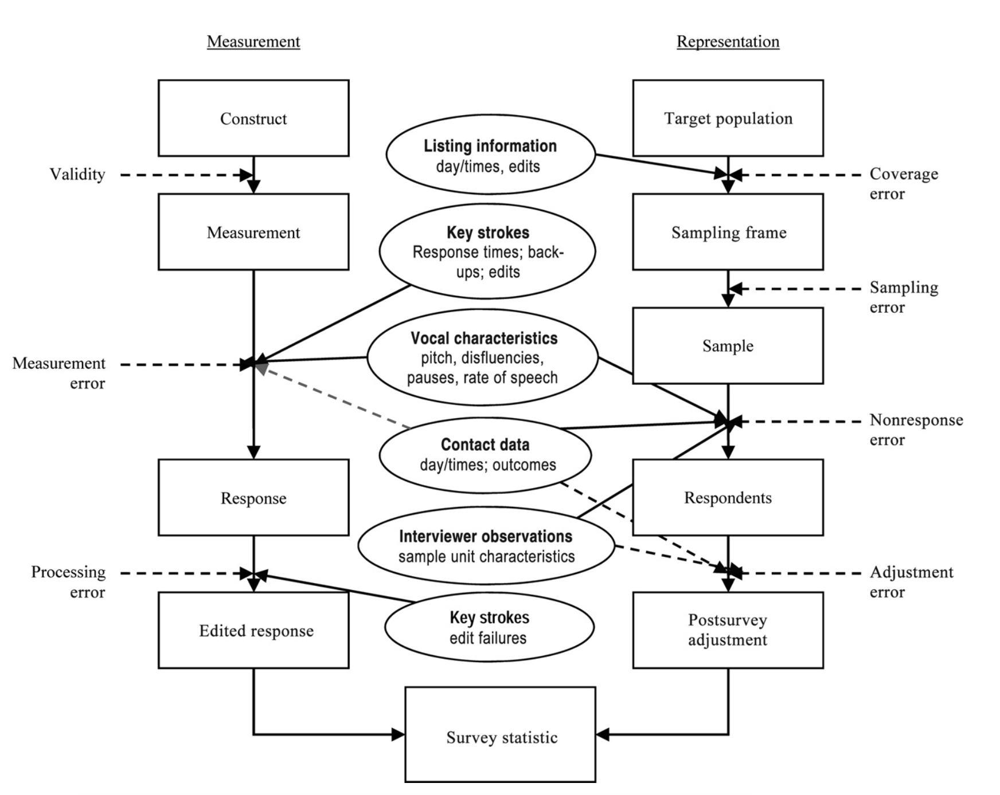

# Paradane

## Paradane -- definicja

Definicje za [@kreuter2013improving] 

**Paradata** are data generated in the process of conducting a survey; generated as a by-product of computer-assisted data collection; Data about the process by which the survey data were collected.

Respondents in web surveys leave electronic traces as they answer survey questions, captured through their keystrokes and mouse clicks. In telephone surveys, automated call scheduling systems record the date and time of every call. In face-to-face surveys, interviewers’ keystrokes are easily captured alongside the interview and so are audio or even video recordings of the respondent– interviewer interactions. Each of these is an example of paradata available through the computerized survey software.

Paradata vs Metadata.

Paradata vs Zmienne Pomocniczne (ang. auxiliary variables).

## Znaczenie paradanych

## Przykłady wykorzystania

## Dalsze kroki

